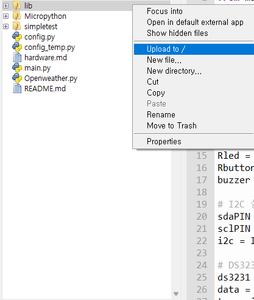

# AI Challenge for Biodiversity 발대식 실습교육 

파일 및 폴더           | 내용
:------------- |:-------------
[lib](/lib/ds3231_port.py) | DS3231 RTC 모듈 라이브러리 
[Micropython](/Micropython/RPI_PICO_W-20231005-v1.21.0.uf2) | 라즈베리파이 피코용 Micropython UF2파일   
[simpletest](/simpletest/README.md) | DataPi를 제어하기 위한 기본동작 코드 
[main.py](/main.py) |  DataPi로 온도데이터를 수집하는 Micropython 코드 
[Openweather.py](/Openweather.py) | Openweather API를 활용하여 날씨정보를 가져오는 예제   
[config_temp.py](/config_temp.py) | Openweather.py에서 필요로하는 Wifi정보와 API key 정보를 넣는 템플릿    

## 실습목록   
### DataPi로 데이터 수집   
1. DataPi에 Micropython 설치하기  
    1. [Github](/https://github.com/microschool-kr/AI-Challenge-Biodiversity-DataPi-kit)에 접속하여 [Code] -> [Download Zip] 
    
    2. DataPi를 컴퓨터에 연결하기  
        - BootSEL 버튼을 누른 채로 USB연결
        
        - RPI-RP2 드라이브가 연결됨 
    3. Micropython폴더에 `RPI_PICO_W-20231005-v1.21.0.uf2`파일을 RPI-RP2 드라이브에 옮기기 
    
    4. Thonny를 실행하여 RaspberryPi Pico가 포트로 잡히는지 확인 
2. Thonny를 이용하여 lib폴더를 Raspberry pi Pico에 업로드 하기  

3. Thonny로 `main.py` 실행하기   

4. DataPi로 온도 데이터 수집하기   
    - 온도 센싱 기능 
        - 버튼(오른쪽)을 **1초 이하**로 누르면 시작/중단합니다. 
        - 노란색LED가 데이터를 가져올때마다 점등됩니다.      
    - 온도 기록 기능 
        - 버튼(오른쪽)을 **1초 이상**을 누르면 온도 데이터 기록을 시작/중단합니다.  
        - 데이터가 기록될 때 빨간색으로 켜져 있습니다. 
4. 온도데이터를 시각화하기 

5. 온도데이터를 저장하기  
    - 데이터는 `temperature_data.csv` 파일에 저장되고 새로 기록할 때마다 추가가됩니다.   
    

###  DataPi 제어하기 
- [Blink.py](/simpletest/Blink.py) : 라즈베리파이 피코 W에 장착되어 있는 LED 점등 
- [Button.py](/simpletest/Button.py) : 버튼 테스트
- [Buzzer.py](/simpletest/Buzzer.py) : 버저 테스트
- [LED.py](/simpletest/LED.py) : LED 테스트 
- [Temp.py](/simpletest/Temp.py) : 온도센서 테스트 
- [i2c.py](/simpletest/i2c.py) : 연결된 i2c장치 확인하기. 현재는 DS3231(0x68)와 at24c32(0x57)를 연결된 것을 확인가능 
- [Button_handler](/simpletest/Button_handler.py) : 버튼의 상태에 따라서 함수를 정의하는 예제 
### Openweather API로 데이터 수집하기   
1. [openweathermap](https://openweathermap.org/)에 접속하기 
2. openweathermap에 회원 가입하기하고 API Key발급받기  

3. 알고 싶은 지역을 검색하기 

4. [`config_temp.py`](/config_temp.py)에 Wifi정보와 Openweather API 키를 입력하고 `config.py`로 파일명 변경하기   
```python
# config.py
wifi_config = {
    'ssid': 'your_ap_name', # Wifi AP 이름
    'password': 'password_for_your_ap_here' #와이파이 비밀번호
}

api_config = { # OpenWeather 사이트의 키
    'api_key': 'your_api_key'
}
```
5. [`Openweather.py`](/Openweather.py)을 실행하기 


